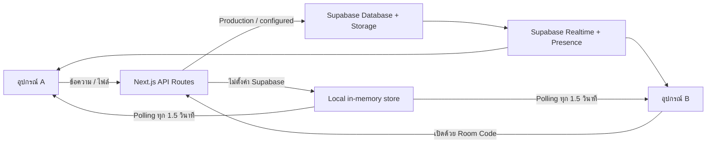

# TextBridge

TextBridge คือเว็บแอปสำหรับส่งข้อความ ลิงก์ โค้ด และไฟล์ระหว่างโทรศัพท์ แท็บเล็ต และคอมพิวเตอร์ผ่าน “ห้อง” ที่เข้าใช้งานด้วยรหัสสั้น ๆ โดยไม่จำเป็นต้องสมัครบัญชี ผู้ใช้สามารถสร้างห้อง เปิดห้องเดียวกันบนอีกอุปกรณ์ แล้วเริ่มส่งข้อมูลถึงกันได้ทันที

โปรเจกต์สร้างด้วย Next.js App Router, React, TypeScript, Tailwind CSS และ Supabase รองรับทั้งการซิงก์แบบเรียลไทม์ผ่าน Supabase และโหมด local in-memory สำหรับทดลองใช้งานโดยไม่ต้องตั้งค่าฐานข้อมูล

## สารบัญ

- [ความสามารถหลัก](#ความสามารถหลัก)
- [ภาพรวมการทำงาน](#ภาพรวมการทำงาน)
- [เทคโนโลยีที่ใช้](#เทคโนโลยีที่ใช้)
- [สิ่งที่ต้องมี](#สิ่งที่ต้องมี)
- [เริ่มต้นใช้งานแบบ Local](#เริ่มต้นใช้งานแบบ-local)
- [ตั้งค่า Supabase](#ตั้งค่า-supabase)
- [ตัวแปรสภาพแวดล้อม](#ตัวแปรสภาพแวดล้อม)
- [คำสั่งที่ใช้บ่อย](#คำสั่งที่ใช้บ่อย)
- [วิธีใช้งาน](#วิธีใช้งาน)
- [โครงสร้างโปรเจกต์](#โครงสร้างโปรเจกต์)
- [API Routes](#api-routes)
- [ฐานข้อมูลและ Storage](#ฐานข้อมูลและ-storage)
- [PWA และ Web Share Target](#pwa-และ-web-share-target)
- [การ Deploy บน Vercel](#การ-deploy-บน-vercel)
- [ความปลอดภัยและข้อจำกัด](#ความปลอดภัยและข้อจำกัด)
- [การแก้ปัญหาเบื้องต้น](#การแก้ปัญหาเบื้องต้น)

## ความสามารถหลัก

- สร้างห้องด้วยรหัสอัตโนมัติ 6 ตัว หรือกำหนดรหัสเอง 4–12 ตัวอักษร/ตัวเลข
- เข้าห้องจากอุปกรณ์อื่นด้วย Room Code, ลิงก์ หรือ QR Code
- ส่งข้อความ ลิงก์ อีเมล หมายเลขโทรศัพท์ และ code snippet
- ตรวจจับประเภทข้อความอัตโนมัติและแสดง preview ที่เหมาะสม
- อัปโหลดหลายไฟล์ด้วย file picker, drag and drop หรือวางไฟล์จาก clipboard
- แสดงตัวอย่างรูปภาพ, PDF และไฟล์ข้อความที่รองรับภายในหน้าเว็บ
- ดาวน์โหลด คัดลอก แก้ไข ปักหมุด ส่งซ้ำ และลบรายการใน timeline
- ค้นหาและกรองเฉพาะข้อความ ไฟล์ หรือรายการที่ปักหมุด
- Export ข้อมูลในห้องออกเป็นไฟล์ JSON
- ตั้งชื่อและสีประจำอุปกรณ์ เพื่อแยกแหล่งที่มาของข้อความและไฟล์
- แสดงอุปกรณ์ที่ออนไลน์, จำนวนรายการที่อ่านแล้ว และ unread count
- ห้องส่วนตัวพร้อมรหัสผ่านที่ hash ด้วย `scrypt`
- ตั้งเวลาหมดอายุ 10 นาที, 1 ชั่วโมง, 24 ชั่วโมง หรือไม่หมดอายุ
- เจ้าของห้องสามารถล็อกการเขียน เปลี่ยนรหัสผ่าน ต่ออายุ ทำให้ห้องถาวร และล้างข้อมูลในห้อง
- ลงชื่อเข้าใช้ด้วย Google เพื่อบันทึกห้องถาวรไว้ในบัญชี
- ตั้งห้องเริ่มต้นสำหรับ Quick Send บนอุปกรณ์นั้น
- ติดตั้งเป็น PWA และรับข้อมูลจากเมนู Share ของระบบที่รองรับ Web Share Target
- รองรับ Light/Dark theme
- มี rate limiting ระดับ API เพื่อลดการยิงคำขอซ้ำจำนวนมาก

## ภาพรวมการทำงาน



โค้ดฝั่ง client ไม่เขียนข้อมูลลงตารางหรือ Storage โดยตรง การสร้างห้อง อ่าน/เขียนข้อความ และจัดการไฟล์จะผ่าน Next.js API Routes ก่อน จากนั้น server จะเลือกใช้ Supabase หรือ local store ตามตัวแปรสภาพแวดล้อมที่ตั้งไว้

## เทคโนโลยีที่ใช้

| ส่วน | เทคโนโลยี |
|---|---|
| Framework | Next.js 15 (App Router) |
| UI | React 19, Tailwind CSS, Base UI, Lucide React |
| ภาษา | TypeScript |
| Backend API | Next.js Route Handlers |
| Database/Auth/Realtime/Storage | Supabase |
| State และ utilities | Zustand, Zod, clsx, tailwind-merge |
| PWA | Web App Manifest, Service Worker, Web Share Target |
| Deployment | Vercel พร้อม Vercel Cron |

## สิ่งที่ต้องมี

- [Node.js](https://nodejs.org/) 20 LTS ขึ้นไป
- npm (ติดมากับ Node.js)
- บัญชี [Supabase](https://supabase.com/) หากต้องการเก็บข้อมูลถาวร, Realtime, Auth และ Storage
- บัญชี [Vercel](https://vercel.com/) หากต้องการ deploy ตามการตั้งค่าที่มีในโปรเจกต์

## เริ่มต้นใช้งานแบบ Local

### 1. Clone repository

```bash
git clone <YOUR_REPOSITORY_URL>
cd TextBridge
```

### 2. ติดตั้ง dependencies

```bash
npm install
```

หากต้องการติดตั้งตามเวอร์ชันใน `package-lock.json` แบบตรงกันทุกเครื่อง แนะนำให้ใช้:

```bash
npm ci
```

### 3. สร้างไฟล์ environment

คัดลอก `.env.example` เป็น `.env.local`

```bash
cp .env.example .env.local
```

บน PowerShell:

```powershell
Copy-Item .env.example .env.local
```

หากยังไม่ตั้งค่า Supabase สามารถปล่อยค่าในไฟล์ว่างไว้ก่อนได้ แอปจะทำงานใน local in-memory mode

### 4. เปิด development server

```bash
npm run dev
```

จากนั้นเปิด [http://localhost:3000](http://localhost:3000)

> [!IMPORTANT]
> Local mode เก็บห้อง ข้อความ และไฟล์ไว้ในหน่วยความจำของ Node.js process เท่านั้น ข้อมูลจะหายเมื่อ restart server และข้อมูลอาจไม่ตรงกันเมื่อรันหลาย instance จึงเหมาะสำหรับพัฒนาและทดลองใช้ ไม่เหมาะกับ production

## ตั้งค่า Supabase

### 1. สร้างโปรเจกต์

สร้างโปรเจกต์ใหม่ใน Supabase Dashboard แล้วจดค่า Project URL, anon/public key และ secret key หรือ legacy service role key

### 2. สร้าง schema

เปิด **SQL Editor** ใน Supabase Dashboard แล้วรันไฟล์ [`supabase/schema.sql`](./supabase/schema.sql) ทั้งไฟล์ สคริปต์นี้จะดำเนินการดังต่อไปนี้:

- เปิด extension `pgcrypto`
- สร้างตาราง `rooms`, `messages`, `files`, `users` และ `room_members`
- สร้าง private Storage bucket ชื่อ `textbridge-files`
- ตั้งขนาดไฟล์สูงสุดของ bucket เป็น 100 MB
- เปิด Row Level Security (RLS)
- จำกัดสิทธิ์ตารางข้อมูลหลักไม่ให้ client อ่าน/เขียนโดยตรง
- เพิ่ม indexes ที่ใช้ค้นหาห้อง ข้อความ ไฟล์ และสมาชิก
- เพิ่ม `rooms`, `messages` และ `files` เข้า Supabase Realtime publication
- สร้าง shared rate limiter สำหรับใช้ข้าม server instances

ไฟล์ใน `supabase/migrations/` มีไว้สำหรับอัปเกรดฐานข้อมูลเดิม หากติดตั้งใหม่ให้ใช้ `supabase/schema.sql`; หากมีฐานข้อมูลเดิม ให้รัน migration ล่าสุดใน `supabase/migrations/` ด้วย

### 3. ตั้งค่า Environment Variables

เติมค่าต่อไปนี้ใน `.env.local`:

```dotenv
NEXT_PUBLIC_SUPABASE_URL=https://YOUR_PROJECT_REF.supabase.co
NEXT_PUBLIC_SUPABASE_ANON_KEY=YOUR_ANON_OR_PUBLISHABLE_KEY
SUPABASE_SECRET_KEY=YOUR_SECRET_KEY
CRON_SECRET=GENERATE_A_LONG_RANDOM_SECRET
```

หากโปรเจกต์ Supabase รุ่นเก่าใช้ service role key ให้ใช้ตัวแปรนี้แทน `SUPABASE_SECRET_KEY`:

```dotenv
SUPABASE_SERVICE_ROLE_KEY=YOUR_SERVICE_ROLE_KEY
```

> [!CAUTION]
> ห้ามเติม prefix `NEXT_PUBLIC_` ให้ secret key หรือ service role key และห้าม commit `.env.local` ขึ้น Git เพราะ key ดังกล่าวมีสิทธิ์ระดับ server และ bypass RLS ได้

### 4. เปิด Google Login (ไม่บังคับ)

ตัวแอปยังใช้ส่งข้อมูลแบบ guest ได้โดยไม่ต้อง login แต่ฟีเจอร์ Saved Rooms และ Owner Controls ต้องมีบัญชีผู้ใช้

1. ไปที่ **Authentication → Providers → Google** ใน Supabase Dashboard
2. เปิดใช้งาน Google provider และกรอก OAuth Client ID/Secret
3. เพิ่ม callback URL ของ Supabase ใน Google Cloud Console ตาม URL ที่ Dashboard แสดง
4. ไปที่ **Authentication → URL Configuration**
5. ตั้ง Site URL เป็น URL ของแอป เช่น `http://localhost:3000` หรือ production domain
6. เพิ่ม localhost และ production URL ใน Redirect URLs

หลังตั้งค่าแล้ว ปุ่ม **Continue with Google** จะแสดงเมื่อ `NEXT_PUBLIC_SUPABASE_URL` และ `NEXT_PUBLIC_SUPABASE_ANON_KEY` มีค่า

## ตัวแปรสภาพแวดล้อม

| ตัวแปร | ฝั่งที่ใช้ | จำเป็น | รายละเอียด |
|---|---|---:|---|
| `NEXT_PUBLIC_SUPABASE_URL` | Client + Server | สำหรับ Supabase | URL ของ Supabase project |
| `NEXT_PUBLIC_SUPABASE_ANON_KEY` | Client + Server | สำหรับ Supabase | anon key หรือ publishable key สำหรับ Auth/Realtime |
| `SUPABASE_SECRET_KEY` | Server เท่านั้น | สำหรับ Supabase | secret key ที่ server ใช้จัดการ database และ Storage |
| `SUPABASE_SERVICE_ROLE_KEY` | Server เท่านั้น | ทางเลือก | ชื่อเดิมที่รองรับแทน `SUPABASE_SECRET_KEY` |
| `CRON_SECRET` | Server เท่านั้น | สำหรับ cleanup cron | token สำหรับยืนยันคำขอไปยัง `/api/cron/cleanup` |

ลำดับการเลือก server key คือ `SUPABASE_SECRET_KEY` ก่อน แล้วจึง fallback ไป `SUPABASE_SERVICE_ROLE_KEY`

## คำสั่งที่ใช้บ่อย

| คำสั่ง | รายละเอียด |
|---|---|
| `npm run dev` | เปิด development server |
| `npm run build` | สร้าง production build |
| `npm run start` | เปิด production server หลัง build |
| `npm run lint` | ตรวจ lint ตาม script ของโปรเจกต์ |

ตัวอย่างการทดสอบ production build ในเครื่อง:

```bash
npm run build
npm run start
```

## วิธีใช้งาน

### สร้างและเข้าห้อง

1. กด **Create Room** เพื่อใช้รหัสที่ระบบสุ่มให้
2. หากต้องการกำหนดรหัสเอง ให้เปิด **Advanced options** แล้วกรอกรหัส 4–12 ตัวอักษร/ตัวเลข
3. เลือกว่าจะใช้ห้องแบบ Open หรือ Private
4. เลือกเวลา Auto-expire หรือเลือก Never สำหรับห้องถาวร
5. เปิด TextBridge บนอุปกรณ์อีกเครื่อง แล้วกรอกรหัสเดียวกัน หรือสแกน QR Code ในหน้าห้อง

### ส่งข้อความและไฟล์

- พิมพ์ข้อความแล้วส่งตามปกติ
- ลากไฟล์มาวางในหน้าห้อง
- ใช้ปุ่มเลือกไฟล์เพื่ออัปโหลดหลายไฟล์
- วางรูปหรือไฟล์จาก clipboard โดยตรง
- กด `Ctrl/Cmd + U` เพื่อเปิด file picker
- กด `/` ขณะไม่ได้พิมพ์ใน input เพื่อโฟกัสช่องค้นหา

ระบบแยกประเภท `link`, `email`, `phone`, `code` และ `text` อัตโนมัติจากเนื้อหา

### ห้องถาวรและ Saved Rooms

- ห้องที่เลือก Auto-expire เป็น **Never** จะถือเป็นห้องถาวร
- เมื่อผู้ใช้ที่ login เปิดห้องถาวร ระบบจะบันทึก membership เพื่อให้ห้องปรากฏใน Saved Rooms
- ผู้ใช้สามารถนำห้องออกจากรายการ Saved Rooms ได้โดยไม่ลบห้องจริง
- ห้องที่มีวันหมดอายุจะไม่ถูกเพิ่มใน Saved Rooms

### Owner Controls

ผู้สร้างห้องที่ login อยู่จะเป็นเจ้าของห้อง และสามารถ:

- ล็อก/ปลดล็อกห้อง โดยเมื่อถูกล็อกมีเพียงเจ้าของที่เขียนข้อมูลได้
- ตั้งหรือเปลี่ยนรหัสผ่าน
- ต่ออายุห้อง
- เปลี่ยนห้องให้เป็นห้องถาวร
- ล้างข้อความและไฟล์ทั้งหมดในห้อง

### QR, Share และ Quick Send

- คัดลอกลิงก์ห้องหรือแชร์ผ่าน Web Share API ของอุปกรณ์
- สแกน QR Code เพื่อเปิดห้องบนอุปกรณ์อื่น
- ตั้งห้องปัจจุบันเป็น Default Quick Send เพื่อเปิดจากหน้าแรกได้ในคลิกเดียว
- เมื่อติดตั้งเป็น PWA ระบบที่รองรับสามารถส่งข้อความ/ไฟล์เข้า TextBridge จากเมนู Share ได้

## โครงสร้างโปรเจกต์

```text
TextBridge/
├── app/
│   ├── api/
│   │   ├── cron/cleanup/                 # ลบห้องหมดอายุตาม schedule
│   │   └── rooms/                        # Room, message, file และ owner APIs
│   ├── room/[code]/                      # หน้าห้องและ realtime timeline
│   ├── share/                            # เลือกห้องสำหรับข้อมูลจาก Web Share
│   ├── share-target/                     # Endpoint ที่รับ Web Share POST
│   ├── globals.css                       # Theme และ global styles
│   ├── layout.tsx                        # Root layout, metadata และ PWA registration
│   ├── manifest.ts                       # Web App Manifest
│   └── page.tsx                          # หน้าแรก: สร้าง/เข้าห้อง/Saved Rooms
├── components/
│   ├── ui/                               # UI components
│   ├── auth-button.tsx                   # Google sign-in/sign-out
│   ├── pwa-install-button.tsx            # ติดตั้ง PWA
│   ├── pwa-registration.tsx              # ลงทะเบียน service worker
│   └── theme-provider.tsx                # จัดการ theme
├── lib/
│   ├── server-rooms.ts                   # Business logic และ storage abstraction
│   ├── server-auth.ts                    # ตรวจ Bearer token และ device identity
│   ├── supabase.ts                       # Supabase browser client
│   ├── local-store.ts                    # In-memory fallback
│   ├── rate-limit.ts                     # In-memory API rate limiter
│   ├── device-profile.ts                 # ชื่อ/สีอุปกรณ์และ default room
│   ├── share-target.ts                   # IndexedDB สำหรับ pending shares
│   ├── types.ts                          # TypeScript types หลัก
│   └── utils.ts                          # Room code, formatter และ message detection
├── public/
│   └── sw.js                             # Service worker และ Share Target handler
├── supabase/
│   ├── migrations/                       # SQL migrations สำหรับฐานข้อมูลเดิม
│   └── schema.sql                        # Schema ล่าสุดสำหรับติดตั้งใหม่
├── .env.example                          # ตัวอย่าง environment variables
├── vercel.json                           # Vercel Cron schedule
└── package.json
```

## API Routes

API ที่เข้าห้องส่วนตัวรับรหัสผ่านผ่าน header `x-room-password` ส่วน session ของผู้ใช้ส่งเป็น Bearer token ใน header `Authorization`

| Method | Endpoint | หน้าที่ |
|---|---|---|
| `POST` | `/api/rooms` | สร้างห้องใหม่ |
| `GET` | `/api/rooms/:code` | อ่านข้อมูลและตรวจสิทธิ์เข้าห้อง |
| `GET` | `/api/rooms/:code/messages` | อ่านข้อความในห้อง |
| `POST` | `/api/rooms/:code/messages` | ส่งข้อความ |
| `PATCH` | `/api/rooms/:code/messages/:messageId` | แก้ไข, pin/unpin หรือ soft delete ข้อความ |
| `GET` | `/api/rooms/:code/files` | อ่านรายการไฟล์ |
| `POST` | `/api/rooms/:code/files` | อัปโหลดไฟล์แบบ `multipart/form-data` |
| `PATCH` | `/api/rooms/:code/files/:fileId` | ลบไฟล์และ metadata |
| `GET` | `/api/rooms/mine` | อ่าน Saved Rooms ของผู้ใช้ปัจจุบัน |
| `DELETE` | `/api/rooms/mine/:roomId` | นำห้องออกจาก Saved Rooms |
| `PATCH` | `/api/rooms/:code/owner` | ดำเนินการสำหรับเจ้าของห้อง |
| `GET` | `/api/cron/cleanup` | ลบห้องหมดอายุ ต้องใช้ `Authorization: Bearer <CRON_SECRET>` |
| `POST` | `/share-target` | รับ payload จาก Web Share Target |

ตัวอย่างสร้างห้อง:

```bash
curl -X POST http://localhost:3000/api/rooms \
  -H "Content-Type: application/json" \
  -d '{"code":"MYROOM","isPrivate":false,"expiresInMinutes":60}'
```

ตัวอย่างส่งข้อความ:

```bash
curl -X POST http://localhost:3000/api/rooms/MYROOM/messages \
  -H "Content-Type: application/json" \
  -H "x-device-name: Laptop" \
  -d '{"text":"Hello from TextBridge"}'
```

สำหรับห้องส่วนตัว ให้เพิ่ม `-H "x-room-password: YOUR_PASSWORD"`

### Rate limits ปัจจุบัน

| การทำงาน | Limit |
|---|---:|
| สร้างห้อง | 20 ครั้ง / IP / 10 นาที |
| เปิดห้อง | 30 ครั้ง / IP + Room Code / 5 นาที |
| ส่งข้อความ | 120 ครั้ง / IP + Room Code / 1 นาที |
| อัปโหลดไฟล์ | 30 ครั้ง / IP + Room Code / 10 นาที |

เมื่อกำหนด `SUPABASE_SECRET_KEY` หรือ `SUPABASE_SERVICE_ROLE_KEY` ระบบจะใช้ Supabase RPC เก็บ rate limit ร่วมกันระหว่าง server instances สำหรับฐานข้อมูลเดิม ให้รัน `supabase/migrations/20260926000000_shared_rate_limit.sql` ก่อน deploy หากไม่มี server key แอปจะใช้ in-memory limiter สำหรับ local development ซึ่งไม่แชร์ข้าม instances

## ฐานข้อมูลและ Storage

### ตารางหลัก

| ตาราง | หน้าที่ |
|---|---|
| `rooms` | เก็บรหัสห้อง สถานะ private/locked เจ้าของ และวันหมดอายุ |
| `messages` | เก็บข้อความ ประเภท pin state, sender identity และ soft-delete timestamp |
| `files` | เก็บ metadata และ storage path ของไฟล์ |
| `users` | profile ขั้นต่ำของผู้ใช้ที่ผ่าน Supabase Auth |
| `room_members` | เชื่อมผู้ใช้กับห้องถาวรสำหรับ Saved Rooms |

ไฟล์จริงถูกเก็บใน private bucket `textbridge-files` และ server สร้าง signed URL ที่มีอายุ 1 ชั่วโมงก่อนส่งให้ client การลบไฟล์จะลบทั้ง object ใน Storage และทำ soft delete metadata

ห้อง ข้อความ และไฟล์ใช้ `expired_at` ร่วมกัน งาน cleanup จะลบห้องที่หมดอายุ และ foreign key แบบ `ON DELETE CASCADE` จะลบ metadata ที่เกี่ยวข้อง ส่วน object ใน Storage จะถูกลบโดย cleanup logic ก่อนลบห้อง

## PWA และ Web Share Target

Manifest อยู่ที่ `app/manifest.ts` และ service worker อยู่ที่ `public/sw.js`

- PWA cache เฉพาะ application shell ที่จำเป็น เช่น `/`, `/share` และ icon
- navigation request จะลองใช้ network ก่อนและ fallback ไป cache เมื่อ offline
- Share Target รับ text, URL, image, video, audio, text file, PDF และไฟล์ทั่วไป
- service worker เก็บ pending share และไฟล์ไว้ใน IndexedDB ก่อนพาไปหน้า `/share`
- ผู้ใช้เลือก Room Code แล้วระบบจึงส่ง payload เข้า timeline

PWA และ Web Share Target ต้องทำงานบน HTTPS ใน production ส่วน localhost ใช้ทดสอบ service worker ได้ตามข้อยกเว้นของ browser ทั้งนี้การรองรับ Share Target แตกต่างกันในแต่ละระบบปฏิบัติการและ browser

## การ Deploy บน Vercel

### ผ่าน Vercel Dashboard

1. Push repository ขึ้น GitHub
2. Import repository เข้า Vercel
3. Framework Preset ควรถูกตรวจพบเป็น Next.js อัตโนมัติ
4. เพิ่ม environment variables จากหัวข้อด้านบนให้ครบ
5. Deploy
6. นำ production domain ไปเพิ่มใน Supabase Authentication URL Configuration และ Google OAuth configuration

ไฟล์ `vercel.json` ตั้ง cron ให้เรียก endpoint cleanup ทุกวันเวลา `03:17 UTC`

```json
{
  "crons": [
    {
      "path": "/api/cron/cleanup",
      "schedule": "17 3 * * *"
    }
  ]
}
```

Vercel Cron จะส่ง `CRON_SECRET` ในรูปแบบ Bearer token เมื่อโปรเจกต์ตั้ง environment variable นี้แล้ว สามารถทดสอบ endpoint เองได้ด้วย:

```bash
curl http://localhost:3000/api/cron/cleanup \
  -H "Authorization: Bearer YOUR_CRON_SECRET"
```

### ตรวจสอบก่อน Deploy

```bash
npm ci
npm run build
```

หลัง deploy ควรทดสอบอย่างน้อย:

1. สร้างห้องแบบ Open และ Private
2. เปิดห้องพร้อมกันสองอุปกรณ์แล้วตรวจ Realtime/Presence
3. ส่งข้อความและไฟล์
4. เปิด signed file URL และดาวน์โหลดไฟล์
5. Login ด้วย Google และตรวจ Saved Rooms
6. ทดสอบ Owner Controls
7. ติดตั้ง PWA และทดสอบ Share Target บนอุปกรณ์ที่รองรับ
8. เรียก cleanup endpoint ด้วย secret ที่ถูกต้อง

## ความปลอดภัยและข้อจำกัด

- รหัสผ่านห้องถูก hash ด้วย `scrypt` พร้อม random salt และตรวจด้วย timing-safe comparison
- secret/service role key ใช้เฉพาะ server และต้องไม่ถูกเปิดเผยต่อ browser
- ตารางเนื้อหาหลักเปิด RLS แต่ revoke สิทธิ์จาก `anon` และ `authenticated`; API ฝั่ง server เป็นผู้เข้าถึงข้อมูล
- Storage bucket เป็น private และใช้ signed URL ชั่วคราว
- Room Code ไม่ใช่ความลับ หากข้อมูลสำคัญควรสร้าง Private Room และใช้รหัสผ่านที่คาดเดายาก
- รหัสผ่านห้องที่ผู้ใช้กรอกถูกเก็บใน `sessionStorage` ของ browser tab เพื่อเปิดห้องซ้ำใน session เดิม
- ชื่ออุปกรณ์ สีประจำอุปกรณ์ default room และสถานะอ่านล่าสุดถูกเก็บใน `localStorage`
- local mode เก็บข้อมูลในหน่วยความจำของ process และ rate limiter จะใช้ in-memory fallback เมื่อไม่มี server key; ทั้งสองอย่างไม่แชร์ข้าม server instances
- local mode จำกัดไฟล์ไม่เกิน 10 MB; Supabase Storage จำกัดไฟล์ไม่เกิน 100 MB
- แอปไม่มี end-to-end encryption เนื้อหาถูกประมวลผลบน server และจัดเก็บใน backend ที่ตั้งค่าไว้
- ฟีเจอร์ offline ของ PWA เป็นการ fallback หน้า application shell ไม่ได้รองรับการส่งข้อความแบบ offline queue เต็มรูปแบบ

## การแก้ปัญหาเบื้องต้น

### แอปขึ้น Local mode ทั้งที่ตั้ง Supabase แล้ว

ตรวจว่ามีค่าครบทั้งสามส่วนและ restart development server หลังแก้ `.env.local`:

```dotenv
NEXT_PUBLIC_SUPABASE_URL=...
NEXT_PUBLIC_SUPABASE_ANON_KEY=...
SUPABASE_SECRET_KEY=...
```

หากมีเพียง public URL/key ตัว browser client จะถูกสร้าง แต่ server จะยังไม่มีสิทธิ์ใช้ persistent storage และจะ fallback ไป local store

### Login ด้วย Google แล้ว redirect ไม่กลับแอป

- ตรวจ Site URL และ Redirect URLs ใน Supabase
- ตรวจ Authorized redirect URI ใน Google Cloud Console
- ตรวจว่าใช้ domain และ protocol ตรงกัน เช่น `http://localhost:3000` กับ `https://your-domain.com`

### Realtime หรือ Presence ไม่อัปเดต

- ตรวจว่ารัน `supabase/schema.sql` ครบ
- ตรวจว่าตาราง `rooms`, `messages` และ `files` อยู่ใน `supabase_realtime` publication
- ตรวจค่า public URL/key ใน browser
- เปิด browser console เพื่อตรวจ WebSocket หรือ authentication errors

### อัปโหลดไฟล์ไม่ได้

- ตรวจว่า bucket `textbridge-files` ถูกสร้างและเป็น private
- ตรวจ `SUPABASE_SECRET_KEY` หรือ `SUPABASE_SERVICE_ROLE_KEY`
- ตรวจขนาดไฟล์: local mode ไม่เกิน 10 MB และ Supabase bucket ไม่เกิน 100 MB
- ตรวจ server logs สำหรับ Storage error โดยตรง

### Cleanup endpoint ตอบ `401` หรือ `503`

- `401 Unauthorized`: ค่า Bearer token ไม่ตรงกับ `CRON_SECRET`
- `503 CRON_SECRET is not configured`: ยังไม่ได้ตั้ง environment variable หรือยังไม่ได้ redeploy หลังเพิ่มค่า

## การมีส่วนร่วม

1. Fork repository
2. สร้าง branch สำหรับงานของคุณ
3. แก้ไขและตรวจด้วย `npm run build`
4. Commit พร้อมข้อความที่อธิบายการเปลี่ยนแปลงชัดเจน
5. เปิด Pull Request พร้อมขั้นตอนทดสอบและภาพประกอบหากมีการเปลี่ยน UI

ตัวอย่างชื่อ branch:

```text
feature/add-room-history
fix/private-room-access
docs/update-setup-guide
```

---

สร้างด้วย Next.js และ Supabase เพื่อให้การส่งข้อมูลข้ามอุปกรณ์ทำได้รวดเร็วและตรงไปตรงมา
